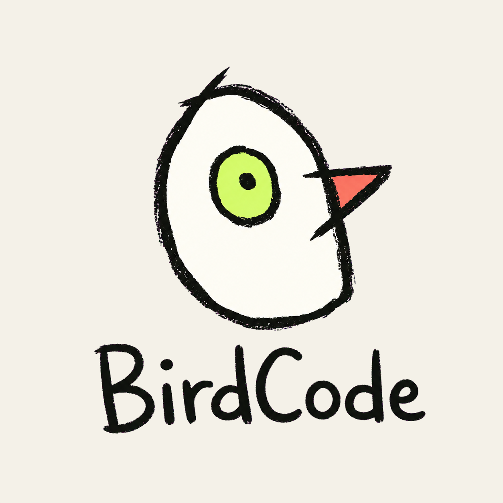
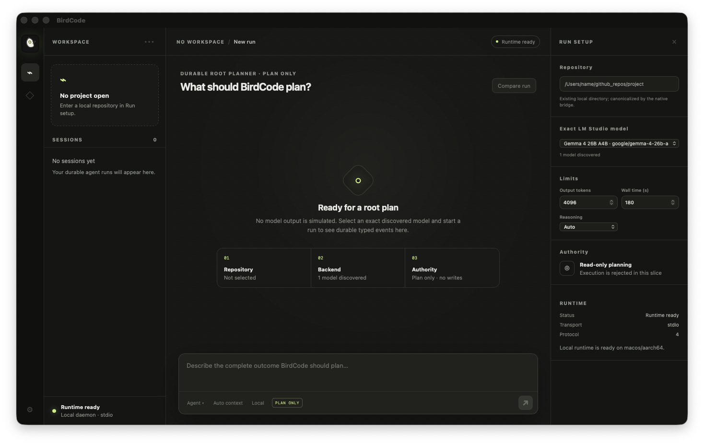
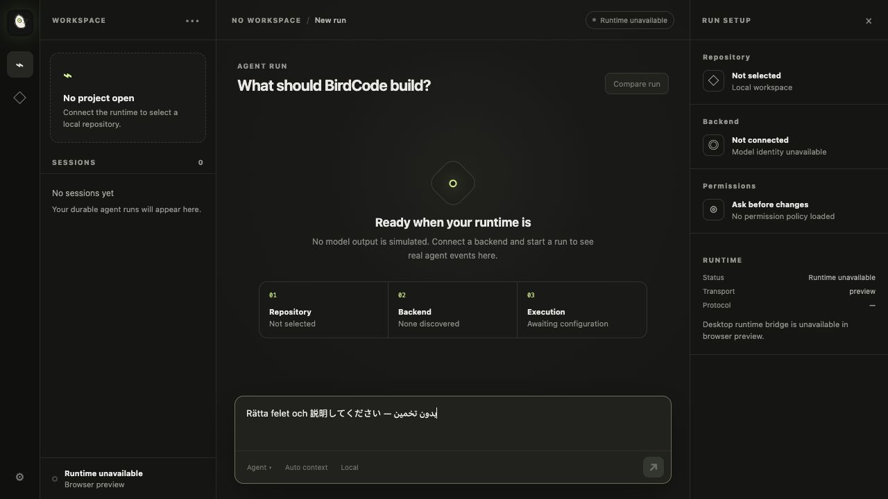
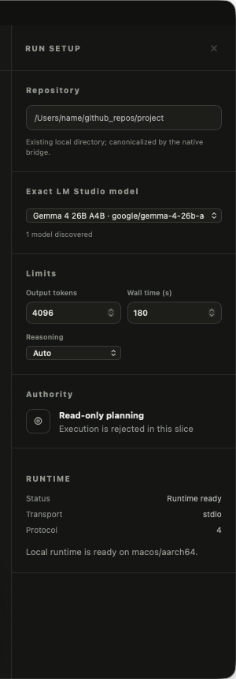
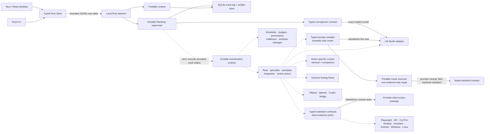

<p align="center">
  
</p>

<h1 align="center">BirdCode</h1>

<p align="center"><strong>BirdCode - Makes your code fly.</strong></p>

<p align="center">
  A local-first agentic coding harness where language models make semantic<br>
  decisions and deterministic Rust code enforces boundaries.
</p>

<p align="center"><code>macOS ARM64 first</code> · <code>Rust + Tauri</code> · <code>LM Studio</code> · <code>pre-alpha</code> · <code>UNLICENSED</code></p>

BirdCode is being built for developers who want the power of a modern coding
agent without surrendering the runtime, history, context strategy, or backend
choice to an opaque service. The product direction is a complete desktop-first
application with a shared CLI, durable long-running sessions, dynamic
subagents, and support for both local models and external agent backends.

The north-star metric is deliberately harder than feature parity: BirdCode is
designed to produce more complete, buildable, working applications than the
strongest available Codex Sol/Ultra baseline under fair clean-room comparison.
That is a measured product target, not a superiority claim the current
foundation has earned.

The project is currently at the **durable root-planner milestone**. The native
desktop and CLI can discover an exact already-loaded LM Studio model, submit a
real `PlanOnly` run to the local daemon, and replay the resulting typed events
and hash-verified artifacts. The daemon retains the compiled prompt, exact
request, provider evidence, proposed plan, deterministic validation, accepted
plan, budget use, claims, cancellation, and terminal state.

That is the first operational model-authored product path, not yet a coding
agent. The live root planner receives the user's goal and repository identity;
it does not yet inspect repository contents, call tools, edit files, execute
work orders, launch child agents, replan from tool evidence, or commission an
independent semantic critic.

> **Plainly:** BirdCode can now ask a real local model for a durable, typed root
> plan through the GUI or CLI. It cannot execute that plan yet, so it is still
> not a Codex replacement.

## Parallel agency is the execution model

BirdCode is not one model in a loop with a test runner bolted on. Its defining
execution model is a durable graph of isolated agents. A root orchestrator must
be able to map a repository, decompose work, launch independent implementers
and specialists concurrently, exchange evidence through structured mailboxes,
select and integrate candidate work, commission independent review, and replan
until the acceptance gate passes or the declared budget is exhausted.

Testing is one agent role and one tool family—not the purpose of subagents.
Parallel actors are intended for repository discovery, planning,
implementation, competing solutions, debugging, platform operation, security,
accessibility, UX review, integration, context distillation, documentation, and
blind outcome review. Semantic decisions stay model-driven through versioned
typed contracts; the local runtime enforces permissions, budgets, isolation,
causal history, cancellation, mailbox delivery, and publication gates.

**Current truth:** the product-wired path performs one initial root-planning
turn only. A separate tested planner/replanner kernel already represents
model-authored `Execute`, `Delegate`, `Clarify`, `Escalate`, and `Finish`
directives plus bounded plan patches and revisions, but it is not connected to
the daemon path. No child actor, worktree lease, mailbox, handoff, integration,
or independent review actor executes today.

## Current interface

<p align="center">
  
</p>

<p align="center"><sub>The real native macOS application: local daemon ready, protocol v4 negotiated, and the exact loaded Gemma model discovered. No model output is simulated.</sub></p>

<table>
  <tr>
    <td width="66%"></td>
    <td width="34%"></td>
  </tr>
  <tr>
    <td><sub>Earlier composer-focused capture: multilingual goals remain data; language intent is interpreted by the model contract rather than keyword or regular-expression branches.</sub></td>
    <td><sub>Cropped detail from the native capture: exact loaded-model selection, bounded PlanOnly authority, local stdio transport, and protocol v4.</sub></td>
  </tr>
</table>

## Why BirdCode

### Semantics belong to the model

User intent, relevance, delegation, and conflict resolution are semantic
problems. BirdCode uses versioned LLM prompts with typed inputs and outputs for
those decisions instead of language-specific keyword lists, regular
expressions, or brittle string parsing. Multilingual requests are a first-class
requirement.

Deterministic code still owns everything mechanical: schemas, permissions,
budgets, state transitions, persistence, hashes, ordering, and protocol
compatibility.

### Durable by construction

The authoritative session history is an append-only SQLite event log. Large
values live as content-addressed artifacts, while event reads are bounded and
resumable. Schema upgrades use durable checkpoints, and current run state is an
atomically maintained indexed projection rather than a scan of an arbitrarily
long history. The planned context compiler and compaction system will optimize
the active prompt without deleting the raw history or its provenance.

### Backend freedom without a false common denominator

BirdCode distinguishes between:

- **model backends**, where BirdCode owns the agent loop; and
- **agent backends**, which already own an inner coding loop.

The provider-neutral model contract and LM Studio adapter exist today. Ollama,
the OpenAI API, and a local Codex bridge are planned. The Codex bridge will use
Codex-managed authentication from the user's installed client; it will not
scrape credentials or copy private implementation code.

### A general Tooling Plane

Agents need far more than a test command. BirdCode's planned Tooling Plane is a
permissioned, schema-first capability layer shared by root, specialist,
candidate, integration, and review actors.

| Tool family | Required reach |
| --- | --- |
| Repository intelligence | Tree/search, symbols and references, dependencies, ownership, and change impact |
| Change construction | Bounded file reads/writes, patches, renames, deletes, diffs, and generated assets |
| Git and isolation | Snapshots, branches, worktrees/overlays, patch export, merge, and conflict inspection |
| Shell and processes | Typed argv, PTY, streaming logs, process trees, ports, cancellation, and cleanup |
| Build and language intelligence | Compilers, package managers, formatters, linters, tests, and language-server evidence |
| Web, API, and servers | Playwright, DOM/accessibility, HTTP/WebSocket, network traces, and service lifecycle |
| Desktop and devices | macOS UI/accessibility, Apple simulators, Android, Windows, and Linux adapters |
| Knowledge and integrations | Official documentation, search, issues, pull requests, and CI systems |
| Artifacts and media | Logs, traces, screenshots, video, reports, manifests, and content hashes |
| Coordination and security | Task graphs, mailboxes, handoffs, review findings, credentials, grants, and publication approval |

Every tool must declare typed inputs and outputs, side-effect class, permission
scope, idempotency, cancellation behavior, output bounds, and provenance. The
Execution & Validation Plane consumes this infrastructure continuously, but it
has a distinct job: define and judge evidence rather than act as the whole
agent platform.

### Validation is part of coding

The target loop does not stop at generated source. Agents continuously build,
start, operate, observe, and repair real applications through one provider-blind
Execution & Validation Plane. Compiler/test results, exit codes, DOM and
accessibility state, APIs, logs, traces, and persisted state are primary
evidence. Screenshots and video support visual and UX review, but vision can
never turn a mechanically failing result into a pass.

## Status

BirdCode is pre-alpha and currently optimized and verified first on macOS with
Apple Silicon.

| Area | Status | What works now |
| --- | --- | --- |
| Tauri 2 + React desktop | Implemented PlanOnly slice | Starts the real daemon, discovers exact loaded LM Studio models, submits/cancels one root-planning run, holds ambiguous starts for exact typed reconciliation, replays typed events, and verifies every displayed artifact hash |
| Rust CLI | Implemented PlanOnly subset | `doctor`, `session-smoke`, `models`, and `plan`; successful plan output is only the verified accepted JSON artifact |
| Local daemon and client | Implemented PlanOnly slice | Protocol v4 over bounded JSON-lines/stdio, durable background supervision, client-stable run identity, bounded dispatch, claims, typed failures, deadlines, cancellation, replay, and exact model selection |
| Durable store | Implemented foundation | Append-only events, bounded paging, checkpointed upgrades, indexed run state, closed-world schema health, token ledgers, claim leases, and verified content-addressed artifacts |
| Durable root planner | **Product-wired** | One real LM Studio inference produces `Plan`, `Clarify`, or `Escalate`; prompt/request/raw evidence/proposal/validation/accepted plan are retained and causally bound |
| Semantic task router | Implemented standalone | LLM-classified action, access, and delegation strategy with typed collect-all validation and no heuristic fallback |
| Standalone router executor | Implemented standalone | First-pass routing plus at most one typed, patch-only evidence repair; fake-backend tested and not daemon-wired |
| Planner/replanner kernel | Implemented standalone | Model-authored plan patches and `Execute`/`Delegate`/`Clarify`/`Escalate`/`Finish` directives are bounded against independent obligations, context, budgets, and authority; not daemon-wired |
| Actor-graph scheduler kernel | Implemented standalone | Validates model-authored DAGs against an independent trusted policy, executes read-only dependency-ready workers concurrently, bounds retries/deadlines/cleanup/budgets, and retains typed causal provenance; writes fail closed and no production worker or durable journal exists yet |
| LM Studio backend | Implemented; PlanOnly-wired | Exact read-only discovery plus strict structured inference with bounded HTTP behavior; used by the durable root planner and standalone versioned evals |
| Execution & Validation Plane | Implemented typed foundation | Composite surface/platform targets, immutable run manifests, commands, bounds, hash-linked provenance, evidence policy, and blind review packages; no process or platform adapter executes yet |
| Agent execution loop | **Initial planning turn only** | The daemon invokes LM Studio for root planning; repository discovery, tool use, work-order execution, repair, and semantic review do not execute yet |
| Context compilation and compaction | Designed | Architecture and invariants are documented; runtime implementation remains |
| General Tooling Plane and permission broker | Designed, not implemented | No repository, shell, filesystem, Git, browser, or platform tool is exposed to a live agent yet |
| Parallel agent runtime | **Kernel only; not product-wired** | A standalone generic scheduler executes test workers with real overlap, but no model-backed child, broker-provisioned workspace, durable mailbox/journal, cancellation/recovery, or integration path executes through the daemon |
| Ollama and OpenAI adapters | Planned | Provider contract exists; adapters do not |
| Local Codex bridge | Planned | Clean-room adapter direction is documented; no product integration exists yet |
| Windows and Linux | Planned | Core boundaries are portable, but builds and platform behavior are not yet verified |

The durable root planner is the exception to the otherwise standalone agent
kernels: it is connected end to end through both GUI and CLI and has been run
against the locally loaded Gemma model. The semantic router, portable router
executor, richer planner/replanner, and actor-graph scheduler remain
fake-worker/backend validated kernels and are not yet daemon capabilities.
The validation-plane crate likewise defines and tests contracts only; it does
not yet run commands, launch applications, drive Playwright, or capture media.

## Proof, not promises

The strongest retained signals for this foundation are deliberately narrow and
reproducible:

- **A real durable root-planning turn completed through the product path—and
  exposed the next missing layer.** From source
  `006786caec7f484a07a3d8fb1851e0246e56e154`, the CLI selected exact loaded
  model `google/gemma-4-26b-a4b`, submitted multilingual Swedish/Japanese
  input, and completed run `019f7bdc-f4a1-7d40-84d3-347ab32013e8`. The daemon
  retained eight ordered run events, 2,912 reported tokens, and six
  hash-addressed artifacts. Mechanical validation accepted the typed plan;
  independent semantic review rejected it because it proposed two sequential
  discovery orders rather than the requested parallel audits and structured
  handoffs. This proves transport, persistence, inference, mechanical
  acceptance, and honest failure retention—not planning quality or code
  execution. [Inspect the review](docs/reviews/2026-07-19-durable-root-planner-review.md)
  and [the exact retained artifacts](docs/evidence/2026-07-19-root-planner-live/).
- **9/9 semantic-router cases passed in one non-repairing inference per case.**
  The run used `google/gemma-4-26b-a4b` Q8_0 with reasoning off on macOS ARM64.
  [Inspect the retained report](evals/reports/2026-07-19-gemma-4-26b-q8-router-v1.1.3.json),
  tied to source `9e12f133d60cd9dad5dd4bbc0ca6e6cedc8bde72`; report
  SHA-256
  `0275440b73ac4ef9fe3df441b44fdced8e0bc3c4e3492662e1b744eb04565ece`.
- **The deterministic foundation gate is green.** Source commit
  `3a05d2972b2efcc2b3067594b928f90418e1e93c` passed 194 Rust test
  executions, 9 GUI tests, strict linting, type checking, production web build,
  CLI persistence smoke, and native ARM64 app/DMG verification. A separate
  read-only coding-agent review found no open P0-P2 defects in its declared
  scope. [Read the retained release-gate review](docs/reviews/2026-07-19-foundation-review.md).
- **The typed validation-plane gate is green.** Source commit
  `405ff2d5e51e4adeb7ec4159cc5d33f41590e2ec` passed 18/18 adversarial
  validation tests and the expanded 212-execution Rust workspace gate, plus the
  existing 9 GUI tests, strict linting, CLI smoke, and native ARM64 app/DMG
  checks. The retained review includes exact artifact hashes, same-lineage
  audit limits, and a hash-bound local Gemma secondary review. This proves the
  contract foundation—not any process or platform adapter.
  [Read the validation-plane release gate](docs/reviews/2026-07-19-validation-plane-review.md).
- **Failures are retained too.** [The report history](evals/reports/) preserves
  four earlier router snapshots, while the root-planner review preserves two
  schema failures and the final semantically insufficient plan instead of
  cherry-picking only green-looking output.
- **Scope matters.** This proves the standalone router against its nine-case
  catalog and the initial daemon-owned planning turn against one retained live
  request. It does not validate work-order execution, live-model repair,
  repository tools, child agents, compaction, or product security.

## Architecture

The solid path below exists today. Dashed connections show the next integration
layers rather than current runtime behavior.



The canonical protocol and core runtime are independent of Tauri, operating
system APIs, and provider-specific payloads. Platform behavior belongs behind
adapters so Windows and Linux can be added without replacing the core.

Read the normative [product requirements](docs/product-requirements.md),
[target architecture](docs/architecture.md), [subagent orchestration design](docs/orchestration.md),
[validation policy](docs/validation.md), and [clean-room benchmark protocol](docs/benchmarking.md).

## Quick start on Apple Silicon

The verified development toolchain is Rust 1.92, pinned by
`rust-toolchain.toml`, and Node.js 22.16.0 (minimum 22.12.0). Native desktop
development also requires the normal macOS/Xcode command-line build tools.

From the repository root:

```sh
npm ci
cargo test --workspace
npm test
npm run typecheck
npm run dev
```

`npm run dev` prepares the host-native daemon sidecar and opens the Tauri
desktop application. With one language model already loaded in LM Studio, the
UI discovers its exact ID and can perform the real read-only root-planning
turn. Controls for later execution and comparison stages remain disabled.

To build and exercise the current CLI subset:

```sh
cargo build --workspace
target/debug/birdcode doctor
target/debug/birdcode session-smoke
target/debug/birdcode models
target/debug/birdcode plan --model <exact-loaded-model-id> \
  --goal "Plan the complete outcome" --workspace /path/to/repository
```

`session-smoke` creates a multilingual test session, reloads it through the
daemon, and verifies that the durable value is unchanged.

Development path overrides:

- `BIRDCODE_DAEMON` selects a daemon executable.
- `BIRDCODE_DATA_DIR` selects the local state directory.

## LM Studio discovery and live evaluation

The LM Studio tools default to `http://127.0.0.1:1234/`. Discovery is read-only
and never loads, unloads, or downloads a model.

Inspect the model catalog reported by an already-running instance:

```sh
cargo run -p birdcode-backends --example lmstudio_probe
```

Run the small strict-JSON connectivity prompt against an exact model ID
returned by discovery:

```sh
cargo run -p birdcode-backends --example lmstudio_probe -- --infer <exact-model-id>
```

Run the catalog-driven semantic-router evaluation against exactly one already
loaded language model:

```sh
cargo run -p birdcode-prompting --example lmstudio_router_eval -- \
  --infer-loaded \
  --output evals/reports/local-router-eval.json \
  --source-revision "REVISION" \
  --lm-studio-version "VERSION" \
  --lm-studio-version-source "VERSION_SOURCE"
```

Use the exact Git commit or immutable source-snapshot identifier for
`REVISION`. Copy `VERSION` from LM Studio's application UI and describe that
location precisely in `VERSION_SOURCE` (for example, `LM Studio About dialog`);
the discovery API does not report the application version itself.

The current nine-case catalog covers multilingual delegation, clarification
instead of unsafe guessing, repository prompt injection, direct informational
answers, irrelevant repository context that must not be cited, zero-delegation
read-only work, an English direct-change request that requires workspace write
access, intent-bearing Japanese clarification, and intent-bearing Arabic
delegation. Expectations include required and forbidden evidence sections and
bounded clarification/subtask counts, not only route labels. A single case can
be selected explicitly by adding:

```sh
--case semantic-router.arabic-delegation
```

The v4 evidence rubric is causal rather than cite-all. Repository context is
required when it supplies otherwise unnamed delegated targets or when rejecting
a repository control attempt is itself a safety decision. Redundant repository
context is forbidden for the zero-delegation and direct English-change cases;
the Arabic delegation case is user-only. Expected subtask counts are
evaluator-only scoring metadata, separate from the prompted runtime delegation
limit. That limit defaults to four and is zero only in the versioned
zero-delegation fixture.

The runner reserves and syncs a new report path before its first HTTP request.
It then finalizes that reservation as `passed` or `failed`, including discovery,
inference, validation, and semantic-mismatch failures, before returning a
nonzero exit status. The report records its source revision, timestamp,
runner/platform identity, LM Studio version and evidence source, the selected
model's bounded identity/quantization evidence, SHA-256 digests of the complete
discovery response bodies, credential-free endpoints, raw inference evidence,
prompt/case digests, and validated or rejected semantic output. The runner
also records the runtime delegation limit and prints the exact final report
SHA-256. Case identifiers and expectations remain evaluator/report metadata
and are never compiled into model input; model-visible data provenance uses
only opaque, reproducible `eval-fixture:<case SHA-256>:<ordinal>` identifiers.
Existing reports are never overwritten, and full LM Studio model inventories,
local model paths, and unrelated model configuration are not copied into
reports.

Optional configuration:

- `BIRDCODE_LMSTUDIO_URL` changes the server URL.
- `LM_STUDIO_API_TOKEN` supplies a bearer token without placing it in command
  history.

LM Studio URLs containing user information, query strings, fragments, or a
non-root base path are rejected rather than normalized into evidence.

The eval is deliberately opt-in. It fails rather than choosing arbitrarily if
LM Studio reports zero or multiple loaded language models.

## Prompt contracts, not prompt strings

Application prompts are repository data, never instructions to the developer
or coding agent maintaining BirdCode. Every bundled production prompt has a
stable ID, semantic version, declared role, typed invocation and output
schemas, and deterministic contract coverage. The task router additionally has
a retained live-model eval; its evidence-repair prompt is currently
fake-backend tested only.

The product-wired root planner follows the same boundary. Its model-authored
proposal is bound to independently compiled user obligations, context,
authority, budgets, prompt manifest, and exact backend/model identity. Local
code validates those bindings and the plan graph mechanically; it does not use
keywords or regular expressions to infer the user's language or intent, and it
does not mistake structural validity for semantic quality.

The implemented task router returns three independent axes:

- action: `clarify`, `answer`, `inspect`, or `change`;
- strategy: `direct` or `delegate`; and
- required access: `none`, `read_only`, or `workspace_write`.

Repository text and tool output remain separately labelled data with explicit
trust and provenance. Provider-constrained JSON is accepted only after full
local schema validation and cross-field checks against the original runtime
invocation. Router invariants are returned as a typed collect-all report, so a
duplicate citation cannot hide a simultaneous non-repairable defect.

The standalone router executor permits exactly one narrow LLM repair only when
*every* local violation is a duplicate evidence section. The repair model sees
only duplicate section names and their model-generated bases, returns a minimal
replacement patch, and cannot express action, strategy, access, confidence,
questions, or subtasks. BirdCode preserves unique evidence mechanically and
revalidates the complete original router contract after applying the patch. A
caller-provided attempt journal must acknowledge the initial result before any
repair and the repair result before acceptance. The bundled journal is
explicitly in-memory, not a claim of durable persistence. See
[the prompt format](prompts/README.md).

## Security principles

Security work is ongoing and BirdCode has not received an external audit. The
foundation already enforces several important boundaries:

- the React renderer has only Tauri's minimal core capability and receives no
  raw shell, filesystem, credential, or unrestricted IPC access;
- daemon frames, backend request and response bodies, output token counts,
  event payloads, artifacts, and request times are bounded;
- plain HTTP backend URLs are accepted only for loopback hosts; remote servers
  must use HTTPS;
- the LM Studio client disables proxy use and redirect following so sensitive
  prompts and authorization headers stay on the configured origin;
- API tokens use a redacting type and are never included in debug output;
- BirdCode-created state directories use mode `0700` and state files use
  `0600` on Unix; existing roots are preserved only when they are not writable
  by group/others, symlink-sensitive paths are rejected, and artifact hashes
  are verified when content is read;
- schema upgrades are bounded, crash-resumable phases; periodic health checks
  validate the closed-world schema and perform real database and artifact-root
  write/read/fsync/hash canaries without scanning an unbounded event history;
- normalized backend events cannot be committed without a bounded,
  content-addressed, hash-verified raw backend artifact;
- standalone router output is schema- and invariant-validated before
  acceptance; no semantic output is currently connected to tools, and future
  execution paths must additionally pass deterministic permission, budget,
  and state-transition checks; and
- Codex compatibility work follows a clean-room boundary based on public
  documentation and observable behavior.

## Development and verification

Run the full deterministic foundation gate from the repository root:

```sh
cargo fmt --all -- --check
cargo check --workspace --all-targets
cargo clippy --workspace --all-targets -- -D warnings
cargo test --workspace
npm test
npm run typecheck
npm run build
```

Create a native bundle for the current host with:

```sh
npm run tauri:build --workspace @birdcode/desktop
```

The current Apple Silicon bundle targets macOS 11 or newer and is ad-hoc
signed by Tauri so the nested daemon and application bundle can be verified
locally. It is not Developer ID signed or notarized; those are separate
distribution gates for a public release.

Codex Sol/Ultra is used as a development comparison signal when policy and
explicit data-sharing approval permit. The retained review for the current
snapshot is a separate read-only coding-agent review, not a claimed external
Sol/Ultra pass. It records the exact source commit, acceptance gate, findings,
and limitations. Neither form of model review is a security certification; an
LLM is never the sole judge of its own output, so deterministic checks and
focused review remain authoritative wherever possible.

## Repository map

```text
apps/desktop       Tauri 2 + React desktop shell and daemon sidecar manager
apps/cli           Deliberately small CLI over the shared daemon protocol
apps/daemon        Local JSON-lines server
crates/protocol    Provider-, UI-, and OS-independent wire/domain types
crates/client      Bounded daemon process and request client
crates/runtime     Portable mechanical runtime state transitions
crates/store       SQLite event log and content-addressed artifacts
crates/prompting   Versioned prompt registry, compiler, and semantic router
crates/backends    Provider-neutral model contract and LM Studio adapter
crates/orchestrator Standalone semantic routing plus trusted-policy actor-graph scheduling
crates/validation  Typed Execution & Validation Plane contracts and blind evidence policy
prompts            Application prompt manifests and schemas
evals              Versioned semantic evaluation cases
docs               Product, architecture, orchestration, validation, and benchmark specifications
```

## License status

BirdCode is currently [`UNLICENSED`](LICENSE) while the product and
contribution model are being established. The Rust packages are explicitly
non-publishable, and source availability does not grant reuse or redistribution
rights. Supporting open-source models is a backend goal; it is separate from
the application's eventual license decision.

## Roadmap

1. Connect the richer model-authored planner/replanner to durable runtime
   state, repository discovery, bounded context evidence, independent semantic
   review, and explicit acceptance/rejection/repair transitions.
2. Wire two read-only child actors through the standalone scheduler with
   isolated model contexts, broker-attested immutable snapshot leases, durable
   handoffs, cancellation, event replay, and truthful GUI/CLI timelines.
3. Execute one isolated writing child with a Git worktree/overlay, hash-bound
   patch handoff, deterministic integration ownership, and bounded local build
   validation.
4. Prove a genuinely parallel writing graph with atomic live budget ledgers,
   durable mailboxes, candidate selection, subtree cancellation, integration,
   and independent review.
5. Broaden the Tooling and Execution & Validation planes, starting with local
   process and Playwright web slices, then API/server and CLI/TUI adapters.
6. Feed retained evidence back into bounded repair and graph replanning, then
   prove a complete multi-agent build/start/use/repair/revalidate journey.
7. Add semantic retrieval and versioned compaction checkpoints without
   destructive history loss; use eval-derived model profiles to adapt context,
   decomposition, specialists, parallel candidates, and escalation.
8. Add Ollama, OpenAI, and the clean-room local Codex bridge, then run retained,
   blind comparisons through the same harness.
9. Complete the desktop run experience and verify explicit adapters for macOS,
   Apple simulators, Android, Windows, and Linux.

BirdCode's ambition is high: a complete, inspectable coding-agent system that
can improve with better models without becoming dependent on one provider. The
repository is intentionally honest about the distance between that goal and
the current milestone—and builds the durable boundaries before the autonomous
loop depends on them.
