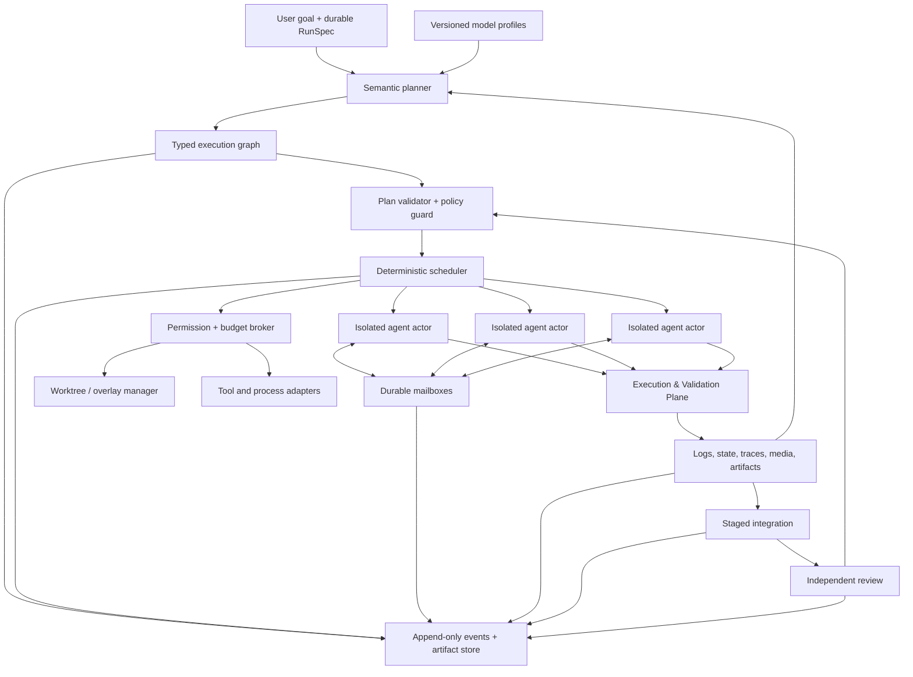
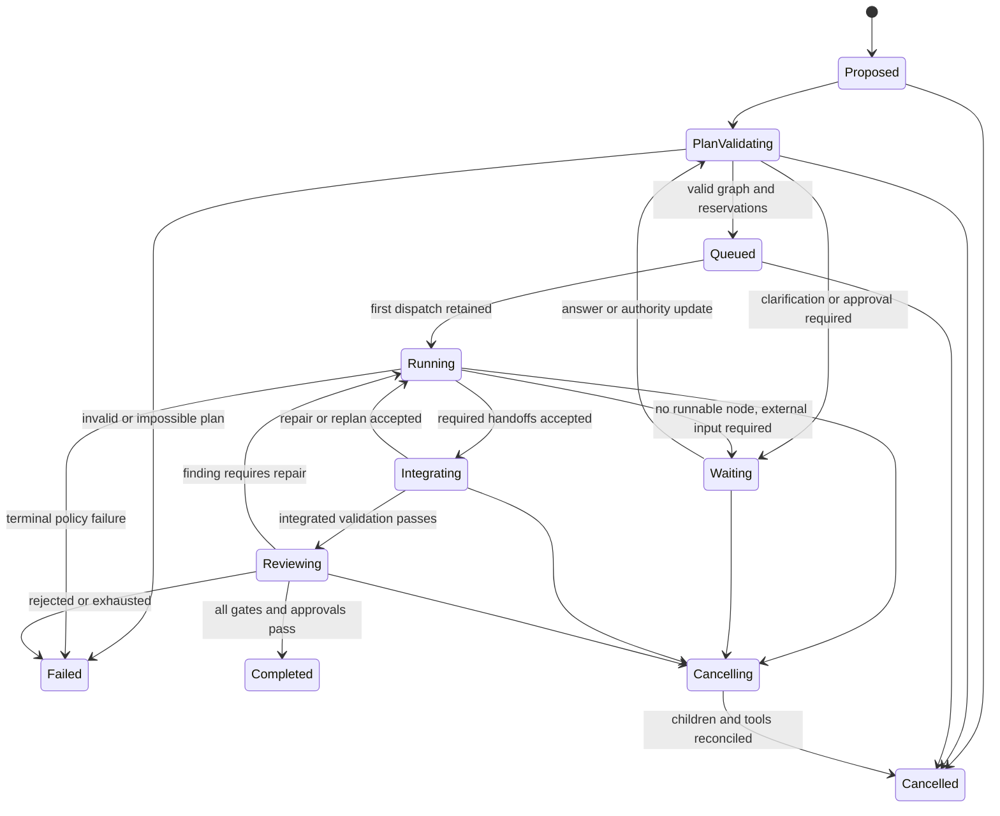
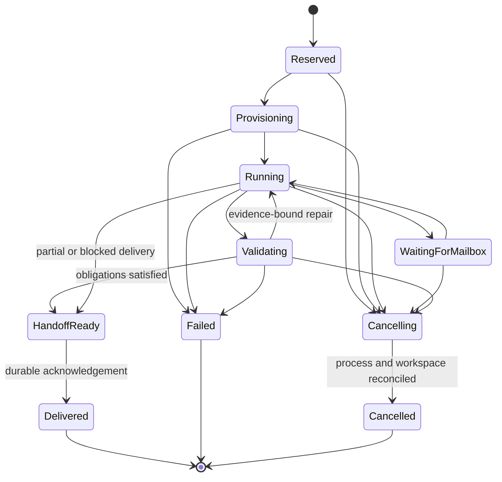

# Target subagent orchestration

This document specifies BirdCode's intended subagent orchestration architecture.
Most of it remains an implementable target. A standalone, read-only-workspace
actor-graph validator and concurrent executor now exist in `crates/orchestrator`.
It has a bounded adapter cleanup callback but not yet a process supervisor; the
daemon-owned agent loop, durable scheduler journal, atomic write-lease manager,
mailboxes, subtree cancellation/recovery, tools, and integration pipeline do
not. The current foundation is described in the repository [README](../README.md);
the broader system boundaries are described in [architecture.md](architecture.md),
the normative direction is in [product-requirements.md](product-requirements.md),
and clean-room comparisons follow [benchmarking.md](benchmarking.md).

The product objective is better completed software, not more agent activity.
BirdCode must be able to use strong and weak open-source models without turning
English phrases, file names, or regular expressions into hidden control logic.
Models decide semantics through versioned, typed contracts. Rust code enforces
mechanical boundaries and records what actually happened.

## Design invariants

1. **Semantic decisions are model decisions.** Intent, relevance, task
   decomposition, role selection, conflict interpretation, and whether evidence
   satisfies a goal are decided by an LLM through a typed prompt contract.
2. **Mechanical policy is code.** Schemas, graph validity, budgets, permissions,
   concurrency, state transitions, path ownership, process containment, hashes,
   ordering, and retry ceilings are enforced deterministically.
3. **No heuristic semantic fallback exists.** If a semantic output is invalid or
   unavailable, BirdCode retries a bounded typed call, selects another eligible
   model, asks for clarification, or fails closed. It never scans user text for
   keywords to guess the answer.
4. **Every child has less or equal authority.** A subagent receives an explicit
   subset of its parent's workspace, tool, network, time, token, and delegation
   authority. Delegation cannot manufacture permission.
5. **Isolation precedes concurrency.** Concurrent writers operate in separate
   worktrees or overlays rooted at the same immutable snapshot. No candidate
   writes directly into the user's active workspace.
6. **Validation is part of execution.** Agents continuously build, start, use,
   observe, and validate the software through the same Execution & Validation
   Plane used for final evaluation.
7. **Evidence outranks confidence.** Compiler results, tests, accessibility and
   DOM state, API responses, logs, exit codes, and persisted application state
   are primary evidence. Screenshots and video supplement them; vision is never
   the only judge.
8. **History is append-only.** Plans, attempts, messages, scheduler decisions,
   tool calls, validation observations, patches, reviews, and terminal outcomes
   form causal event branches. Large values are content-addressed artifacts.
9. **A model does not certify itself.** Candidate production, integration, and
   independent review use distinct actor identities. High-risk results require
   an eligible reviewer that did not produce or integrate the candidate.
10. **Capability is measured, not inferred from a model name.** Model profiles
    are versioned results of explicit evaluations and provider discovery. A
    model name may identify a profile; it never substitutes for one.

## System boundary

The semantic planner and reviewer may use different model backends. The
scheduler, broker, workspace manager, event store, and artifact store are local
runtime components. An agent backend, such as the planned local Codex bridge,
may own an inner loop, but it must still enter BirdCode through the same budget,
permission, isolation, evidence, and result contracts.

## Semantics versus enforcement

The boundary is deliberately explicit:

| Question | Semantic producer | Mechanical enforcement |
| --- | --- | --- |
| What does the user want? | Semantic task router | Output schema, source provenance, and clarification limits |
| Which outcomes constitute completion? | Constraint compiler and planner propose source-cited obligations and criteria; an independent semantic coverage check compares them with the original request | Accepted obligation IDs, mandatory policy IDs, provenance, parent-to-child inheritance, and approved amendments are immutable |
| Should work be decomposed? | Planner, informed by model profiles and evidence | DAG validity, depth, fan-out, concurrency, and total budgets |
| Which model or specialist fits a task? | Planner proposes ranked assignments | Backend capability compatibility, availability, cost ceiling, and permission policy |
| Are parallel candidates useful? | Planner estimates ambiguity and expected value | Candidate cap, independent contexts, shared snapshot, and fair budget allocation |
| Is a repository observation relevant? | Model supplies evidence references | References must exist, be in scope, and be content-hash bound |
| May an agent run a command or edit a path? | Never decided by free-form model text | Permission broker checks typed grants and workspace leases |
| Did a build, test, or interaction succeed? | Adapter observations; optional model interpretation | Exit codes, assertions, state probes, timeouts, and artifact hashes remain authoritative |
| Does a visual result meet the goal? | Vision-capable reviewer interprets captured media | Required non-visual checks must also pass; media must be tied to a captured run state |
| How should a semantic merge conflict be resolved? | Fresh conflict-resolution actor | Three-way conflict detection, allowed-file scope, patch validation, and post-merge gates |
| Is the run complete? | Integrator and independent reviewer propose a verdict | Required evidence, acceptance gates, authority separation, and terminal transition rules |

Provider capability discovery, token accounting, graph traversal, numeric budget
arithmetic, and exact profile lookup are mechanical. Understanding user text or
source code is semantic. A deterministic rule may require validation for every
change; it may not decide that a request is “just documentation” by matching a
word.

## Durable domain model

Existing protocol types remain the outer boundary:

- `Session` identifies the durable conversation and workspace root.
- `RunSpec` identifies the selected backend, input, and `RunLimits`.
- `Run` uses the existing `queued`, `running`, `waiting`, `completed`, `failed`,
  and `cancelled` projection.
- `ActorId`, `EventId`, `causal_parent`, and `Provenance` identify the producer
  and causal history of each authoritative event.
- `ArtifactRef` identifies large immutable values by SHA-256, size, and media
  type.

The orchestration layer adds versioned domain records. Names below are target
contracts, not current Rust APIs:

### `OrchestrationSpec`

- `orchestration_id`: UUID v7, stable across pause and resume;
- `run_id`, `session_id`, and immutable root snapshot digest;
- user goal and compiled-context manifest references;
- plan prompt key, schema digest, and planner attempt ID;
- model-profile snapshot set;
- global permission envelope;
- wall-clock, model-token, tool-call, storage, retry, delegation-depth, and
  concurrency budgets;
- mandatory validation policy and acceptance-criteria references;
- cancellation policy and external-approval requirements.

### `ConstraintSet`

Before task planning, a versioned LLM contract compiles the original user input
and applicable policy into source-cited obligations. Each obligation has a
stable ID, source reference, semantic statement, mandatory/negotiable status,
acceptance-evidence requirement, and explicit supersession history.

A separate semantic coverage check compares the proposed set with the original
input. It returns typed missing, altered, ambiguous, and conflicting obligation
findings with source evidence. When that check is the sole semantic coverage
authority, it must satisfy the model-lineage independence policy used for
review below; otherwise BirdCode obtains a preregistered independent quorum or
human adjudication. Uncertain coverage causes clarification or a fail-closed
plan state.

Deterministic code does not decide whether prose changed meaning. Once the
constraint set is accepted, it enforces obligation IDs mechanically: mandatory
IDs propagate into applicable child work orders, acceptance policies and
integration manifests; they can be changed only through a typed, source-cited
amendment that passes the same semantic coverage gate and any required user
approval.

### `TaskGraph`

A planner emits a directed acyclic graph of `WorkOrder` nodes and typed edges.
Every graph has a schema version and content digest. The mechanical validator
rejects cycles, unknown dependencies, disconnected required nodes, duplicate
identities, excessive fan-out, impossible budgets, or authority expansion
before any child starts.

An edge has one of these meanings:

- `requires`: the predecessor must deliver an accepted handoff;
- `observes`: evidence may be consumed without blocking start;
- `competes_with`: nodes are independent candidates for the same outcome;
- `reviews`: the target must be reviewed by an independent actor;
- `integrates`: outputs are inputs to a staged integration node.

### `WorkOrder`

- globally unique `work_order_id` and causal parent event;
- semantic objective, exclusions, and typed deliverables;
- acceptance criteria with evidence requirements;
- assigned role and ranked eligible model profiles;
- immutable input snapshot and context-manifest reference;
- read set, proposed write scope, tools, network destinations, and secret
  handles requested by the planner;
- mechanically granted permission subset;
- child budget and delegation allowance;
- dependencies, candidate group, priority class, and deadline;
- required validation adapters and independent-review policy.

The requested write scope is a semantic proposal. The granted scope is a
broker decision and may only narrow it. Undeclared writes are rejected even if
the agent believes they are necessary; it must request a typed plan amendment.

### `AgentExecution`

- UUID v7 `execution_id`, `work_order_id`, `actor_id`, and model-profile ID;
- `attempt_id` and optional exact `parent_attempt_id`;
- branch head event and workspace/overlay identity;
- compiled-context manifest and prompt manifest provenance;
- granted permissions and reserved budget ledger;
- backend request, response, normalized events, and usage evidence;
- lifecycle state, heartbeat, cancellation generation, and terminal reason.

Two executions of byte-identical work still receive distinct IDs. A retry is a
new attempt causally linked to the failed attempt; it never overwrites it.

### `Handoff`

- sender, recipient or recipient role, work order, execution, and message IDs;
- causal parent and monotonically increasing mailbox sequence;
- outcome: `completed`, `partial`, `blocked`, `failed`, or `cancelled`;
- concise semantic summary and decision log;
- patch, commit, artifact, and evidence references;
- commands and validation observations relied upon;
- known risks, unresolved questions, assumptions, and requested next action;
- exact source snapshot and resulting snapshot or patch base.

A handoff is a bounded contract, not a transcript copy. The recipient can fetch
referenced artifacts subject to its own permissions.

### `ValidationObservation`

- validation execution and adapter IDs;
- application snapshot, environment manifest, command/tool invocation, agent,
  and model IDs;
- start/end timestamps, timeout, exit status, and process-tree disposition;
- bounded inline preview plus content-addressed stdout/stderr/log artifacts;
- assertions, accessibility/DOM/API/state observations, screenshots, videos,
  traces, and their hashes;
- canonical phase outcomes and individual `passed`, `failed`, or `inconclusive`
  check outcomes from [validation.md](validation.md), never a self-assigned
  benchmark-level `infrastructure_invalid` verdict;
- causal links to the work attempt and any repair spawned from the observation.

## Model profiles

A `ModelProfile` is an immutable, versioned measurement snapshot for one exact
backend/model/configuration tuple. It contains:

- provider identity, native model identity evidence, quantization or serving
  configuration when available, context limit, and supported capabilities;
- prompt-template and structured-output compatibility;
- measured reliability by task family, role, language, context size, tool
  pattern, and output contract;
- latency and token-throughput distributions;
- tool-call, planning, coding, debugging, review, and visual-understanding
  evaluations with raw report references;
- calibration statistics and sample counts, not a single opaque “quality”
  score;
- known failure modes expressed as evaluator findings with evidence, never as
  string triggers applied to user input;
- profile schema, evaluation-suite, harness, source, and environment digests;
- creation time and an explicit freshness/compatibility status.

Profiles are learned from retained evaluations and updated by new evaluation
runs. Production outcomes may become evaluation samples only through a
versioned ingestion policy that removes sensitive content and prevents a model
from grading its own work. A missing or stale profile makes a model
`unprofiled`; it does not cause BirdCode to guess capability from parameter
count or brand.

The planner receives relevant profile summaries as trusted structured data. A
deterministic eligibility filter first removes profiles that cannot meet hard
requirements such as context size, tool support, data locality, or permission
policy. The planner then makes the semantic assignment among eligible models.

### Compensating for weaker models

BirdCode does not hide weaker models. It changes the orchestration strategy
using measured uncertainty and task-specific profile evidence:

- narrower, explicitly bounded work orders and smaller compiled contexts;
- prerequisite research or repository-mapping specialists;
- parallel independent candidates when profile evidence predicts material
  variance;
- separate implementation, test, debugging, integration, and review actors;
- more frequent Execution & Validation Plane checkpoints;
- critique-and-revise rounds with evidence, rather than ungrounded self-review;
- escalation to a better-profiled local model when bounded repair is exhausted;
- user clarification when no eligible model can satisfy the required confidence
  and authority constraints.

The planner chooses these semantic tactics. A versioned allocation policy turns
the chosen tactic into exact numeric reservations. The policy can use profile
measurements and declared risk classes, but cannot inspect natural-language
task text. Its decisions and input profile versions are retained for later
evaluation.

## Planning and adaptive decomposition

Planning is an evidence-driven loop rather than a one-time prompt:

1. The semantic router classifies the requested action, access, and direct or
   delegated strategy.
2. A planner receives the user goal, repository/context manifests, mandatory
   policy, eligible model profiles, and available validation adapters.
3. It emits a typed `TaskGraph`, acceptance criteria, uncertainty claims, and
   citations to the inputs that caused each decomposition decision.
4. The plan validator checks schema, DAG, budgets, permissions, reviewer
   independence, adapter availability, and child-authority monotonicity.
5. Invalid semantic output receives only bounded typed correction. Policy
   violations are not exposed as instructions for evasion and cannot be
   “repaired” by free-form text.
6. The scheduler releases runnable work orders. Evidence from execution and
   validation returns to the planner through content-addressed observations.
7. The planner may emit a versioned `PlanAmendment`: add, cancel, replace,
   split, or join nodes; change eligible roles; or request more authority.
8. The validator compares the amendment with the current graph and remaining
   ledger. Authority increases pause for the required user or policy approval.

Decomposition may be hierarchical, but every depth consumes the root run's
finite delegation and budget envelope. Children cannot create “free” budgets
by subdividing work.

### Parallel candidates and specialists

A candidate group has one shared objective, root snapshot, acceptance policy,
and comparable budget class. Candidates receive isolated contexts and cannot
read each other's in-progress transcripts or worktrees. This preserves useful
independence.

Initial specialist roles are data, not hard-coded personas:

- repository mapper;
- implementation agent;
- test designer;
- build/runtime operator;
- debugger;
- security and permission reviewer;
- accessibility/UX reviewer;
- integration agent;
- independent result reviewer.

Each role is a versioned prompt contract with explicit inputs, outputs, tool
requirements, and evaluation history. A planner may propose new role instances
or a role composition; role selection is never based on keyword matching.

Candidate selection uses the common validation harness. Deterministic failures
remove a candidate from acceptance but remain in the record. When multiple
candidates pass, a blind semantic judge compares only normalized results and
evidence, not provider names, token counts, or author identity. The judge emits
a rubric-scored decision with evidence citations. Mechanical policy checks
that every cited observation exists and belongs to the candidate.

## Context and workspace isolation

Every agent context is compiled specifically for its next action and has a
manifest of included and deliberately omitted sources. At minimum it includes:

- the exact work order and granted authority;
- inherited user constraints and decisions that apply to the child;
- its immutable snapshot and relevant repository observations;
- accepted dependency handoffs;
- current budget and deadline;
- validation evidence relevant to the next action;
- mailbox messages acknowledged by sequence;
- prompt and model-profile provenance.

Untrusted repository content, tool output, and peer messages remain labeled as
data. They cannot alter system policy or permissions. Compaction creates a new
manifest and checkpoint; it never deletes the source events or silently drops
open obligations.

Read-only actors use immutable snapshots or overlays. Writing actors receive a
dedicated Git worktree or equivalent copy-on-write overlay at an exact commit
and repository-state digest. The workspace manager:

- resolves and records canonical paths before granting access;
- prevents escape through symlinks, alternate path encodings, or nested
  repositories;
- enforces read/write scopes and immutable base identity;
- gives each writer an exclusive workspace identity;
- captures untracked files, modes, renames, deletions, and submodule state;
- exports a content-hashed patch/result manifest without merging it;
- destroys or archives the isolated workspace only after durable handoff.

Logical path leases may reduce avoidable overlap, but they do not replace
isolation or three-way conflict detection. An agent must not see another
writer's partial filesystem state merely because both target the same files.

## Budgets and permissions

The root budget is a ledger, not advisory prompt text. Reservations and actual
usage are append-only transactions keyed by execution and attempt IDs.

Budget dimensions include:

- input and output model tokens by backend;
- wall and CPU time;
- concurrent actors and total spawned actors;
- delegation depth and graph-node count;
- tool calls and process launches;
- retry, repair, and replan attempts;
- network bytes/destinations where measurable;
- artifact and workspace storage.

The scheduler reserves the maximum authorized amount before dispatch. Unused
reservation returns to the parent ledger after terminal acknowledgement.
Exhaustion produces a typed terminal or waiting state; it cannot be bypassed by
a handoff or retry.

Permissions are typed capabilities with scope and expiry:

- workspace read and write path sets;
- executable/tool allowlist and argument policy;
- network mode and destination set;
- environment-variable and secret-handle access;
- process, simulator, browser, and GUI-control capabilities;
- ability to delegate, integrate, publish, or request external inference;
- approval identity and reason for any elevated grant.

The broker authorizes each concrete operation, not the agent's stated intent.
Model output, repository instructions, and mailbox messages cannot grant a
capability. Secret values are injected only at the adapter boundary and are
excluded from prompts, logs, artifacts, and error messages unless a user
explicitly authorizes otherwise.

## Deterministic scheduler boundary

The scheduler accepts only a validated graph plus immutable policy, profile,
adapter-availability, and budget snapshots. It does not read raw user text or
source code. Given those inputs and a recorded clock/availability event, it:

1. computes runnable nodes by graph dependency and terminal state;
2. orders equal-priority nodes by stable declared priority and ID;
3. filters mechanically ineligible backend/adapter combinations;
4. reserves budgets, permissions, workspace, and concurrency slots atomically;
5. emits a dispatch event before starting an actor;
6. reconciles heartbeats, deadlines, cancellation generations, and terminal
   acknowledgements;
7. releases leases and schedules newly runnable nodes.

No scheduler branch contains language-specific keywords or parses free-form
model prose. All inputs are schema-validated enums, identifiers, numbers, and
references. A scheduler decision record contains the complete candidate set,
ineligibility reasons, ordering keys, policy version, and resulting reservation
so it can be replayed without invoking a model.

Nondeterministic backend output is not replayed. Replay reconstructs why an
already recorded attempt was dispatched and what happened afterward.

## Mailboxes, handoffs, and coordination

Each actor has a durable mailbox partition. Messages are immutable envelopes
with UUID v7 IDs, sender and recipient actor IDs, mailbox sequence, causal
parent, type, bounded inline body, artifact references, and acknowledgement
state.

Delivery is at-least-once across crashes. Consumers acknowledge message IDs and
must make handling idempotent. Duplicate delivery never creates a new work
order, budget reservation, permission grant, or integration attempt.

Supported message types include:

- `observation`: relevant fact with evidence;
- `question` and `answer`: bounded peer coordination;
- `plan_amendment_request`: proposed semantic graph change;
- `authority_request`: explicit permission escalation;
- `cancellation`: generation-bound stop request;
- `handoff`: terminal or partial delivery contract;
- `review_finding`: severity, scope, evidence, and required disposition.

Actors communicate through mailboxes rather than modifying another actor's
context or workspace. The context compiler selects relevant messages
semantically while preserving unread and omitted-message provenance.

## Execution and validation feedback loop

Every implementation work order includes validation obligations. Agents may
invoke the Execution & Validation Plane during work, not only after handoff.
The plane uses the single canonical lifecycle and outcome taxonomy in
[validation.md](validation.md): `prepare`, `build`, `install`, `launch`,
`readiness`, `exercise`, `inspect_state`, `collect`, `validate`, `terminate`,
`cleanup`, and `package`. `inspect_state` covers real API, persistence,
DOM/accessibility, process and device state; `collect` retains bounded logs,
traces and media; `validate` emits deterministic checks. `terminate` stops
owned processes, while `cleanup` verifies leases, devices, ports and temporary
state before `package` seals the evidence bundle. Non-applicable phases are
recorded explicitly rather than renamed or omitted.

Planned adapters cover API/server, CLI/TUI, Playwright web, macOS desktop,
Apple simulators, Android, Windows, and Linux. Adapter-specific control remains
behind a provider-neutral contract; each adapter declares host support and
capabilities instead of pretending every platform is equivalent.

A failed observation returns to the responsible agent as trusted evidence with
untrusted logs clearly separated. The agent may propose a repair or replan. The
scheduler validates remaining budgets and permissions before another attempt.
The final reviewer receives both passing and failing history, preventing a late
success from erasing earlier diagnostic evidence.

## Retry, repair, and replanning

Failures are classified before policy acts:

| Failure class | Default mechanical response | Semantic response |
| --- | --- | --- |
| Invalid plan/output contract | No execution; one bounded typed correction if policy allows | Clarify, choose another eligible model, or fail |
| Transient backend/transport error | Retry only when typed as retryable, within attempt and time budgets | Reassign after repeated failures |
| Unknown mutation outcome | Never repeat under a new idempotency key | Inspect actual state, then replan |
| Permission denial | Preserve denial and pause the operation | Propose narrower work or request explicit authority |
| Tool/build/test failure | Record exact observation; do not relabel as infrastructure without evidence | Diagnose, repair, split work, or abandon candidate |
| Validation failure | Candidate cannot complete | Evidence-bound repair or new candidate |
| Workspace/integration conflict | Preserve both outputs; no automatic semantic merge | Fresh conflict-resolution work order |
| Budget or deadline exhaustion | Stop dispatch and cancel owned work | Return partial handoff or request a new budget |
| Worker loss/crash | Reconcile durable state and process ownership | Resume from checkpoint or start a causally linked attempt |
| Store/provenance failure | Fail closed before further orchestration | None until durable state is healthy |
| Cancellation | Propagate generation, stop tools, and retain partial evidence | No repair unless a later explicit resume occurs |

Retry repeats an idempotent operation with the same semantic plan. Repair
changes an artifact or candidate in response to evidence. Replanning changes
the task graph. These are distinct event types and budget pools.

A backend retry receives a new attempt ID and exact parent attempt ID. A tool
retry reuses the stable operation/idempotency identity only when the adapter
can prove that behavior safe. Bounded exponential delay may schedule typed
transient retries; it never decides whether an error message “looks transient.”

Repeated repair failure causes replanning or terminal failure, not an unbounded
self-healing loop. A repaired candidate must pass the full original acceptance
policy, not merely the check that triggered repair.

## Integration and conflict handling

Candidates cannot merge themselves. An integration actor works in a fresh
staging worktree at the declared root snapshot:

1. verify handoff, patch, source snapshot, permissions, and artifact hashes;
2. reject out-of-scope or malformed changes before application;
3. apply selected candidates in a recorded order;
4. use mechanical three-way merge detection to identify conflicts;
5. dispatch semantic conflicts to a fresh resolution actor with both candidate
   intents, patches, evidence, and the original goal;
6. run the complete required validation policy on the integrated tree;
7. produce an integration manifest linking every resulting file change to its
   candidate or conflict-resolution attempt;
8. request independent review;
9. publish to the user's target branch/workspace only after all mechanical and
   approval gates pass.

Selecting non-conflicting hunks is not proof of semantic compatibility. The
integrated result must be built and exercised as a whole. The integration
manifest must retain every mandatory obligation ID; a fresh independent
semantic coverage check decides whether the resolved result still satisfies
the original meanings. Mechanical code rejects missing IDs or unapproved
amendments but does not infer semantic equivalence from patches.

## Independent review

Review is a separate work order with no write permission by default. Reviewer
eligibility requires:

- a different `ActorId` from every producer being reviewed;
- recorded producer, integrator, and evaluator model/backend/deployment lineage;
- when semantic review is the sole acceptance authority, at least one evaluator
  outside every producer/integrator lineage, a preregistered independent
  multi-model quorum, or explicit human adjudication;
- no access to hidden candidate labels, provider identity, or leaderboard
  expectation when the review is comparative;
- the required model-profile capabilities for the rubric;
- access to the normalized result, original goal, constraints, acceptance
  policy, and complete validation evidence;
- no authority to weaken mandatory gates.

The reviewer emits typed findings with severity, affected artifact, causal
evidence, confidence, and disposition. Deterministic findings fail the gate
directly. Semantic findings trigger a bounded adjudication policy: accept with
evidence, repair and revalidate, obtain another independent review, or fail.

BirdCode and Codex comparison candidates pass through this same review and
validation path. Candidate identity is unblinded only after verdicts and scores
are durably committed. A claim that BirdCode beats a Codex Sol/Ultra baseline
requires the clean-room, result-based statistical gates in
[benchmarking.md](benchmarking.md); neither model may grade its own labeled
output. The common validation policy remains specified in
[validation.md](validation.md).

## Lifecycle and state machines

The existing public `RunState` remains the coarse durable projection. Detailed
orchestration states are internal typed events and rebuildable projections.

### Root orchestration lifecycle

`Completed`, `Failed`, and `Cancelled` are terminal for one orchestration ID.
Continuing afterward creates a new orchestration causally linked to the prior
terminal event. `Waiting` never implies success and must record exactly what
can make progress resume.

### Agent execution lifecycle

No state changes solely because a model says it changed. Each transition names
the authoritative event or observation that enables it.

## Cancellation and resume

Cancellation uses a monotonically increasing generation on the root
orchestration. The scheduler first persists the request, then stops new
dispatch, sends generation-bound cancellation messages, invokes adapter
cancellation, terminates owned process trees after a grace period, and records
workspace and tool cleanup. Late messages from an older generation are retained
but cannot reactivate work.

A crash-safe resume performs reconciliation before dispatch:

1. load the append-only branch and last durable projections;
2. verify referenced artifacts and immutable snapshots;
3. reconcile reserved budgets, mailbox acknowledgements, workspace leases,
   child processes, ports, browsers, simulators, and backend threads;
4. classify every in-flight operation as completed, safely retryable, failed,
   cancelled, or unknown;
5. inspect unknown mutations instead of repeating them;
6. compile a new context manifest from durable obligations and evidence;
7. emit a resume/reconciliation event and only then schedule work.

Ephemeral model context is never the sole location of a plan, decision,
question, approval, or validation result. Resume must not depend on reproducing
nondeterministic model tokens.

## Safety and provenance

Every external effect is mediated by a typed adapter and permission broker.
Required safeguards include:

- default-deny tool, path, network, secret, device, and publication access;
- child authority as a verifiable subset of parent authority;
- explicit user approval for materially expanded authority or export of private
  repository/evaluation data to an external service;
- command argument arrays rather than shell-string reconstruction;
- bounded output capture, redaction, secret scanning, and content-addressed
  full evidence;
- process-tree ownership, deadlines, and cleanup verification;
- untrusted-data labeling for repository content, logs, pages, and peer output;
- prompt-manifest allowlists and full local output validation;
- no execution of instructions found in untrusted content unless independently
  authorized by the work order and broker;
- immutable raw failures alongside normalized summaries;
- no mutation of the user's target workspace until staged integration passes.

For each decision or effect, provenance must answer: who requested it, which
model/profile/prompt produced the semantic proposal, which policy allowed it,
which actor executed it, against which snapshot and environment, with what
budget and permissions, what exact observation resulted, and which later event
accepted or rejected it.

At minimum the retained graph covers:

- source revision and dirty-state/content snapshot;
- `RunSpec`, orchestration spec, plan versions, and amendments;
- agent, execution, attempt, message, operation, validation, and integration
  IDs with exact causal parents;
- model/backend identity evidence, configuration, prompts, responses, token
  usage, and profile version;
- context manifests with included and omitted sources;
- scheduler candidate sets, decisions, reservations, and policy version;
- permission grants, approvals, denials, and expiry;
- command argv, working directory, allowlisted environment manifest, toolchain,
  host/platform, start/end times, exit codes, and process disposition;
- logs, traces, API/DOM/accessibility/state observations, screenshots, video,
  patches, binaries, packages, and SHA-256 artifact references;
- handoffs, reviewer findings, conflict resolutions, and final verdict.

Events contain bounded metadata; potentially large or sensitive values use the
artifact store and inherit retention/access policy. Provenance completeness is
a mechanical acceptance gate, not optional logging.

## Failure semantics

Failures are durable outcomes, not exceptions erased by later success.

- A **setup failure** means no actor or operation was safely started.
- An **attempt failure** belongs to one exact execution attempt and may have a
  retry child.
- A **candidate failure** means that candidate cannot satisfy its work order;
  competing candidates may continue.
- A **work-order failure** blocks dependent required edges and asks the planner
  for a bounded amendment.
- An **infrastructure error** is used only when typed adapter evidence proves
  the harness, host, backend transport, or device failed independently of the
  candidate. A model cannot assign this label from prose.
- A **policy failure** cannot be repaired by changing model output; it requires
  narrower work, explicit authority, or termination.
- A **root failure** means no valid graph amendment can meet the original goal
  within remaining authority and budget.
- A **partial result** is never represented as completed. It is a handoff with
  explicit missing obligations.

Terminal records include the primary reason, contributing attempt and evidence
IDs, remaining unresolved obligations, cleanup status, and whether a new run
could safely continue.

## Minimum viable vertical slices

Each slice must be usable end to end and retained behind an honestly negotiated
runtime capability. Later slices do not weaken earlier gates.

### Slice 1: one durable executing actor

- Connect one model backend to a daemon-owned agent loop.
- Compile one typed work order, grant read-only tools, execute a bounded
  repository inspection, and retain every attempt/tool observation.
- Resume after an injected daemon crash without replaying an unknown mutation.

Acceptance: 100% causal/provenance completeness on the fixture suite; exact
budget enforcement; zero undeclared tool or path access; deterministic event
replay reaches the same projection.

### Slice 2: one isolated writing child

- Parent delegates one typed change to one child.
- Child receives a dedicated worktree, implements, validates, and returns a
  structured handoff and patch.
- Parent integrates in staging and runs the original acceptance policy.

Acceptance: no child write reaches the parent or user workspace before
integration; out-of-scope writes and symlink escapes fail closed; injected
build failure prevents completion.

### Slice 3: parallel candidates and independent review

- Run at least two isolated candidates concurrently from the same snapshot.
- Validate both through identical adapters, select blindly, integrate, and send
  the result to an independent reviewer.
- Prove that candidates cannot observe each other's live context or workspace.

Acceptance: measured overlap in execution demonstrates real parallelism;
candidate labels remain blinded through committed verdict; reviewer/producer
actor and required model-lineage separation are mechanically enforced; a
same-model/different-actor sole reviewer is rejected; complete failures remain
retained.

### Slice 4: evidence-driven repair and replanning

- Feed compiler, test, runtime, and UI observations back into the responsible
  actor.
- Support bounded repair and a typed graph amendment that splits or replaces a
  failed work order.
- Cancel an in-flight subtree and resume the root run.

Acceptance: no path exceeds configured retry/repair/replan ceilings; full
original validation reruns after repair; cancellation stops owned process trees
and old-generation messages cannot restart them.

### Slice 5: profile-adaptive weak-model orchestration

- Generate immutable profiles for at least one strong and one materially weaker
  open-source model on the same versioned evaluation suite.
- Let the planner use profile evidence to choose decomposition, specialists,
  redundancy, and validation cadence.
- Compare adaptive orchestration with the same weaker model in a fixed direct
  single-agent baseline under declared resource budgets.

Acceptance: the paired benchmark and raw reports are reproducible; the adaptive
policy's primary task-completion improvement has a positive lower 95% paired
bootstrap confidence bound, while permission/provenance failure rates do not
regress. If it does not, the slice is not accepted and the negative result is
retained.

### Slice 6: common cross-system outcome harness

- Execute BirdCode and strongest available Codex Sol/Ultra candidates from
  equivalent clean-room snapshots and `RunSpec`-equivalent constraints.
- Use the same Execution & Validation Plane and blinded semantic rubric.
- Unblind only after immutable verdicts are committed.

The experiment family, contamination controls, repetitions, resource
normalization, and scoring follow [benchmarking.md](benchmarking.md).

Acceptance: environment, permissions, time/token policy, acceptance tests, and
evidence requirements are documented for both arms; missing provider telemetry
is reported rather than estimated as fact. A public “better than Codex” claim
requires BirdCode's lower 95% confidence bound to exceed the predeclared
superiority threshold on the primary complete-application endpoint and no
critical safety-gate regression.

## Cross-cutting acceptance gates

Before orchestration is advertised as implemented, automated suites must prove:

- **Semantic purity:** multilingual and adversarial requests produce decisions
  through versioned model contracts; static inspection and tests find no
  keyword/regex intent or relevance fallback.
- **Schedule determinism:** the same validated graph, profile snapshot, policy,
  availability events, and budgets produce byte-equivalent scheduler decisions
  after excluding newly allocated IDs and recorded timestamps.
- **Budget containment:** randomized concurrency and retry tests never exceed
  any root or child ledger dimension, including after crashes.
- **Authority monotonicity:** property tests prove every child grant is a subset
  of its ancestors and every operation is covered by its active grant.
- **Isolation:** concurrent malicious fixtures cannot read or mutate peer or
  target workspaces, escape through links, or consume peer secrets.
- **Causal integrity:** every non-root event references an existing allowed
  parent; attempts, messages, artifacts, validations, and integrations are
  traceable to exactly one orchestration branch.
- **Mailbox idempotency:** duplicate and reordered deliveries cannot duplicate
  effects, reservations, graph nodes, or handoffs.
- **Crash recovery:** fault injection at every persist/dispatch/tool/acknowledge
  boundary converges to a valid projection without silently repeating an
  unknown mutation.
- **Cancellation:** bounded-time cancellation stops dispatch, owned processes,
  browser/device sessions, and budget consumption; cleanup evidence is retained.
- **Validation truthfulness:** forced compiler, test, DOM/accessibility, API,
  visual, log, and state disagreements never let vision or an LLM override a
  failing mandatory deterministic check.
- **Integration safety:** all published bytes are attributable to accepted
  candidates or reviewed conflict resolutions and pass the integrated gate.
- **Reviewer independence:** a producer or integrator cannot satisfy its own
  required review edge; same-lineage/different-actor semantic self-review is
  rejected whenever policy requires an independent sole reviewer.
- **Provenance completeness:** every accepted benchmark and release fixture has
  commands, environment, model, agent, logs, exit codes, media/traces when
  required, and hashes for every delivered artifact.

Gate reports are immutable artifacts tied to exact source, harness, prompt,
profile, fixture, and environment digests. Failed reports remain alongside
passing reports.

## Deliberate non-claims

This specification does not claim that:

- more subagents always improve a result;
- a weak model can complete every task given enough retries;
- model-profile performance transfers to unmeasured task families;
- deterministic orchestration makes model output deterministic;
- screenshots prove an application is correct;
- a successful build proves complete functionality;
- cross-platform support exists before each adapter is built and exercised on
  its actual platform;
- BirdCode currently outperforms Codex Sol/Ultra.

Those are empirical questions. BirdCode's architecture exists to make them
measurable, reproducible, and difficult to game.
